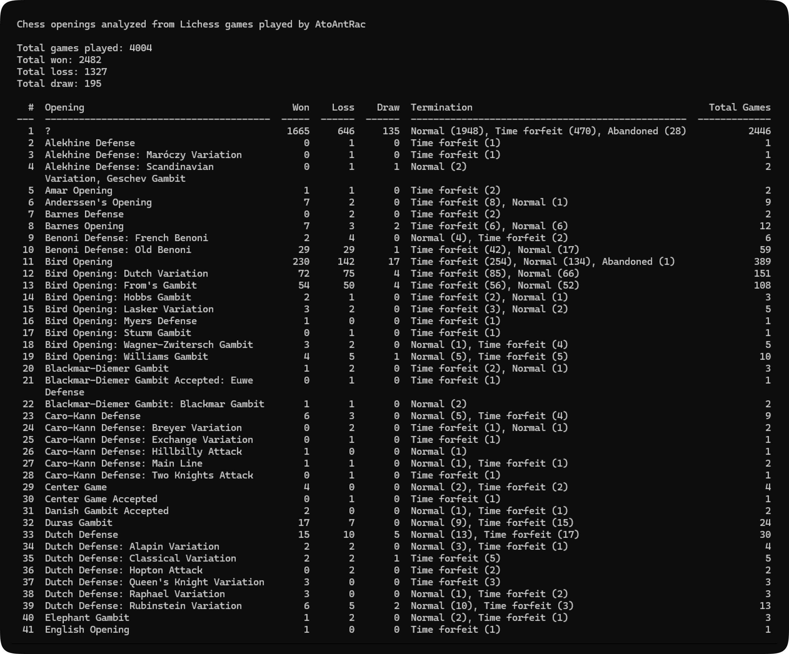

*Script created using Perplexity and Mistral AI.*


# Chess opening move analyzer

This repository contains two Python scripts for analyzing chess games:

1. `chess_opening_analyzer_api.py`: Analyzes chess games from Lichess for a given username.
2. `chess_opening_analyzer_pgn.py`: Analyzes chess games from PGN files to extract statistics about openings and terminations. Works best with Lichess PGN files.



## Dependencies

- Python 3.x
- `requests` library for making API calls (for `chess_opening_analyzer_api.py`)
- `chess` library for parsing chess game data
- `tabulate` library for displaying data in a table format

## Installation

1. Install the required libraries:

```
pip install requests chess tabulate
```

## Usage

1. To analyze chess games from Lichess, run the `chess_opening_analyzer_api.py` script:

```
python chess_opening_analyzer_api.py
```

Follow the on-screen instructions to enter a Lichess username. The script will analyze the chess games of the given user.

2. To analyze chess games from PGN files, run the `chess_opening_analyzer_pgn.py` script:

```
python chess_opening_analyzer_pgn.py
```

Make sure to enable "Opening" before downloading the file. Follow the on-screen instructions to select a PGN file to analyze. The script will extract statistics about openings and terminations from the selected PGN file. If no pgn files in the directory, the terminal will close itself.

## How it works

- `chess_opening_analyzer_api.py`: Makes an API call to retrieve chess games for a given Lichess username. It then analyzes the games to extract information about the openings and terminations, and displays statistics about them in a tabular format.
- `chess_opening_analyzer_pgn.py`: Reads chess games from a PGN file. It analyzes the games to extract information about the openings and terminations, and displays statistics about them in a tabular format.

## Usefulness

These scripts can be useful for chess players and analysts to gain insights into their gameplay. By analyzing chess games, players can identify their strengths and weaknesses, improve their opening repertoire, and learn about common game terminations.

*NB: If you see a question mark (?) in the opening column, it indicates that the specific opening played in those games is not classified or recognized in the standard opening databases. This is common in games that do not follow established opening theory or when the moves played do not correspond to any known opening repertoire. In chess, openings are categorized based on the initial moves, and each category may have a specific name or code (ECO - Encyclopedia of Chess Openings). When a game deviates from these recognized sequences, it may be marked with a question mark to denote that it doesn't fit into any established classification.*