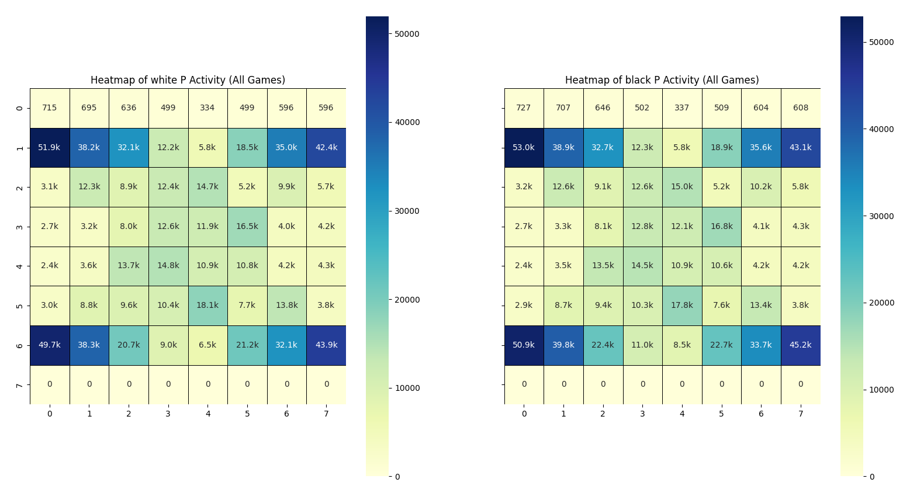

*Script created using Perplexity and Mistral AI.*

# Chess piece activity heatmap
This folder contains two scripts for analyzing chess games and generating heatmaps showing the activity of each piece type on the chessboard. One script scans PGN files in the directory, while the other fetches PGN data from an API. On the heatmap, you can compare how you played from both perspectives.



## Requirements
To run these scripts, you need the following Python libraries:
- `os`
- `chess`
- `numpy`
- `seaborn`
- `matplotlib`
- `requests` (for API version)

You can install the required libraries using pip:

```bash
pip install chess numpy seaborn matplotlib requests
```

## Scripts
### 1. PGN file scanning
This script scans PGN files in the current directory, analyzes the games, and generates heatmaps for piece activity.
#### Usage
1. Place your PGN files in the same directory as the script.
2. Ensure the PGN files are named after the username (e.g., `username.pgn`). Failure to follow this format may cause the script to crash.
3. Run the script or double click.

```bash
python chess_heatmap_pgn.py
```
The script will prompt you to select a PGN file to analyze. After selecting a file, it will display statistics about the games played by the user and generate heatmaps for each piece type.

### 2. API data fetching
This script fetches PGN data from an API, analyzes the games, and generates heatmaps for piece activity.
#### Usage
1. Run the script or double click.
2. You just need to enter your username in the terminal, nothing else.

```bash
python chess_heatmap_api.py
```
The script will fetch the PGN data from the API, analyze the games, and display statistics and heatmaps for each piece type. It may take some time if the data is too big.

## Piece activity calculation
The scripts calculate piece activity by counting the number of times each piece type occupies each square on the chessboard during the games. Here's how it works:

1. For each game, the script initializes a chessboard.
2. It iterates through each move in the game and updates the board accordingly.
3. After each move, the script checks the position of each piece on the board.
4. It increments the corresponding cell in an 8x8 matrix for each piece type based on its position.
5. The resulting matrices are used to generate heatmaps, where the intensity of the color represents the frequency of piece activity.

## Benefits for chess players

- **Heatmaps:** Visual representation of the user's piece activity on the chessboard.
- **Targeted practice:** Focus on areas where your pieces are less active.
- **Easy to understand:** Heatmaps provide a visual representation of piece activity, making it easy to understand complex data at a glance.
- **Pawns:** Indicate preferred opening strategies or pawn structures.
- **Knights and Bishops:** Show tactical preferences and control of the center or flanks.
- **Rooks:** Highlight endgame strategy or rook usage in the middlegame.
- **Queens:** Show aggressive or defensive tendencies.
- **Kings:** Highlight castling habits.