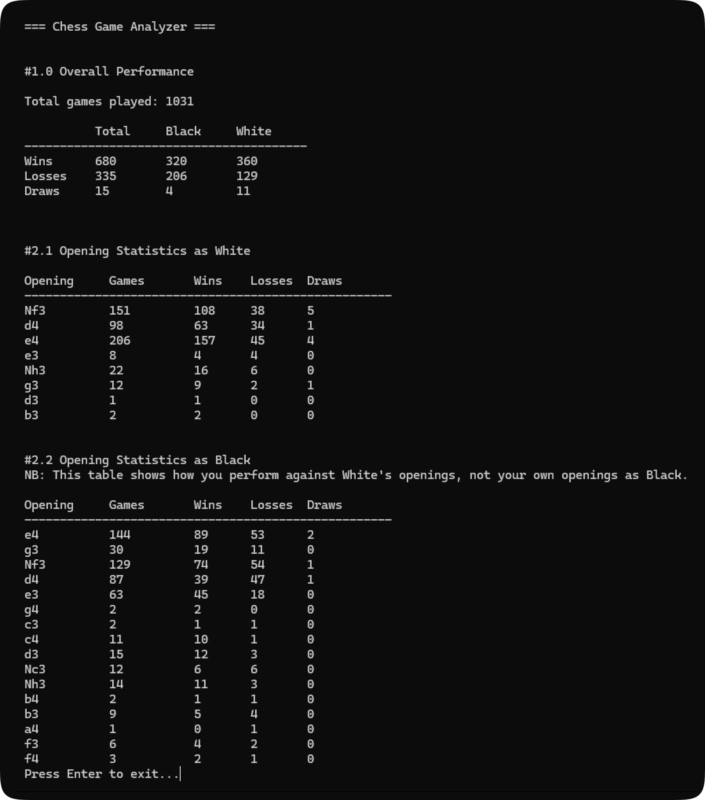

*Script created using Google AI Studio.*

**Important Notes:**
- The PGN file name **must** be in the format `username.pgn` (e.g., `user123.pgn`). Failure to follow this format may cause the script to crash.
- The script should be placed in the same folder as the PGN files to be analyzed. If the folder contains multiple PGN files, the script will process all of them.
- Ensure that the `.py` file is associated with the Python interpreter, so that you can run the script by double-clicking on it. This will allow you to easily execute the script without needing to use the command line.

# Chess results based on first move
This repository contains two Python scripts that analyze chess games to provide insights into player performance based on the game's first move. The scripts can retrieve game data from Lichess API or analyze local PGN files.

## Scripts
`chess_first_move_analyzer_api.py`: Analyzes chess games retrieved from the Lichess API.
`chess_first_move_analyzer_pgn.py`: Analyzes chess games stored in PGN (Portable Game Notation) files.

## Features
- Aggregates statistics for each opening move, including games, wins, losses, and draws
- NB: "Opening Statistics as Black" shows how you perform against White's openings, not your own openings as Black.
## Requirements
- Python 3.x (Download and install Python from the official website: https://www.python.org/downloads)
- `chess` library (install with `pip install python-chess`)
## Usage
- Place PGN files in the same directory as the script
- Run the script using `python` command or double click on it
- The script will process each PGN file and print analysis reports