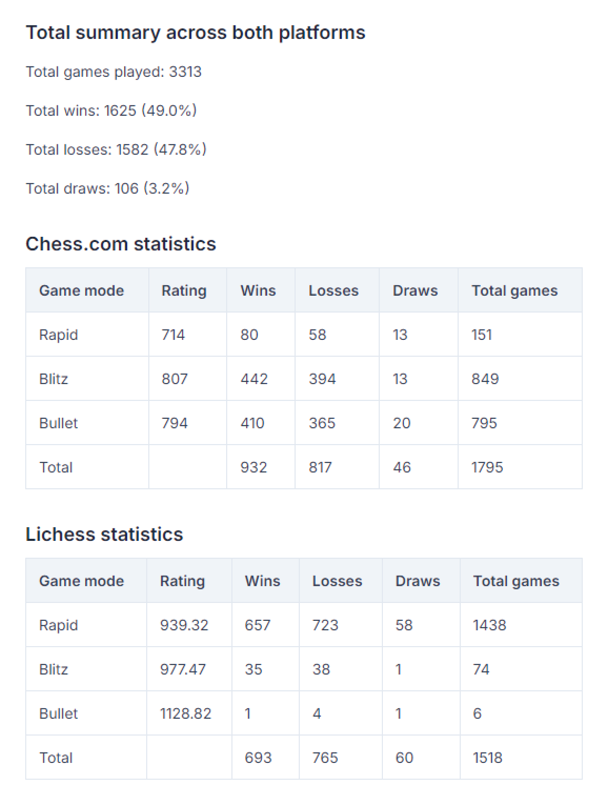

*Script and chrome extension created using Perplexity and Mistral AI.*

> Feel free to check out the code for this Chrome extension in the repository. The code is open, so you can review it and use it as you like. If you notice anything or have suggestions, let me know!

# Unified chess stats tracker
This project consists of a Python script and a Chrome extension that fetch and display chess statistics from both Chess.com and Lichess.org. The Python script fetches and displays statistics in the terminal, while the Chrome extension provides a user-friendly interface to view the same statistics.



## Project structure
```bash
unified-chess-stats-tracker/
├── chrome-extension/
│   ├── background.js
│   ├── manifest.json
│   ├── popup.html
│   ├── popup.js
│   ├── styles.css
│   └── images/
│       ├── icon-16.png
│       ├── icon-48.png
│       ├── icon-128.png
├── unified_chess_stats_tracker.py
└── README.md
```

## Python script
The `unified_chess_stats_tracker.py` script fetches chess statistics from Chess.com and Lichess.org for a given username and displays the combined statistics in the terminal.

### Dependencies
- requests: To make HTTP requests.
- tabulate: To display data in a tabular format.

To install the required dependencies, run:

```bash
pip install requests tabulate
```

### Usage
Run the script using Python or simply double click.

```bash
python unified_chess_stats_tracker.py
```
Follow the prompts to enter your Chess.com and Lichess.org usernames. The script will fetch and display the statistics.

## Chrome extension
The Chrome extension provides a user-friendly interface to view the statistics fetched by javascript.

### Installation
- Open Chrome and navigate to `chrome://extensions/`.
- Enable "Developer mode" by toggling the switch in the top right corner.
- Click on "Load unpacked" and select the chrome-extension directory.

### Usage
- Click on the extension icon in the Chrome toolbar.
- Enter your Chess.com and Lichess.org usernames.
- Click "Submit" to fetch and display the statistics.