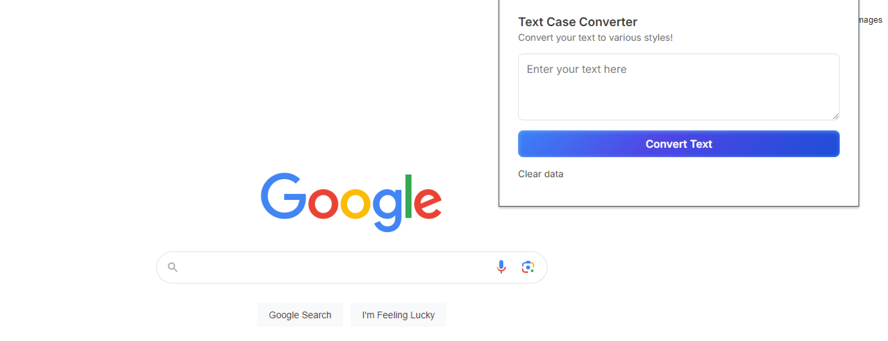

*Scripts and chrome extension created using Mistral AI, Google AI Studio, Perplexity and Meta AI.*

> Feel free to check out the code for this Chrome extension in the repository. The code is open, so you can review it and use it as you like. If you notice anything or have suggestions, let me know!

# Text case converter
This repository contains various scripts and a chrome extension for converting text into different cases. The scripts are written in different languages such as Batch Script (bat), Python, and JavaScript. The project includes a Chrome extension, a Telegram bot, and standalone scripts for terminal use.

- chrome-extension/: Contains the files for the Chrome extension.
- telegram-bot/: Contains the JavaScript (js) and Python (py) files for the Telegram bot.
- `text-case-converter.bat`: A standalone Batch Script for converting text cases in the terminal.
- `text_case_converter.py`: A standalone Python script for converting text cases in the terminal.

## Usage
### Chrome Extension
- Open Chrome and navigate to `chrome://extensions/`.
- Enable "Developer mode" at the top right corner.
- Click on "Load unpacked" and select the chrome-extension/ directory.
- The extension will be added to your Chrome browser.
- It's simple as that! You can check all the code, everything created with LLMs.

### Telegram Bot
- Create a new bot on Telegram using [BotFather](https://t.me/BotFather).
- Replace the TOKEN in the JavaScript (js) or Python (py) file with your bot's token.
- Deploy the script on a cloud service or deploy it in Google AppScript for personal use.
### Standalone Scripts
#### Batch Script (text-case-converter.bat)
- Open a terminal and navigate to the project directory.
- Run the script using the command `text_converter.bat` or simply doublick on it.
- Enter your text and see the different case conversions.
#### Python Script (text_case_converter.py)
- Open a terminal and navigate to the project directory.
- Run the script using the command `python text_converter.py` or simply doublick on it.
- Enter your text and see the different case conversions.

> Convert text to various styles:
- UPPERCASE
- lowercase
- Title Case
- Sentence case
- camelCase
- PascalCase
- snake_case
- kebab-case